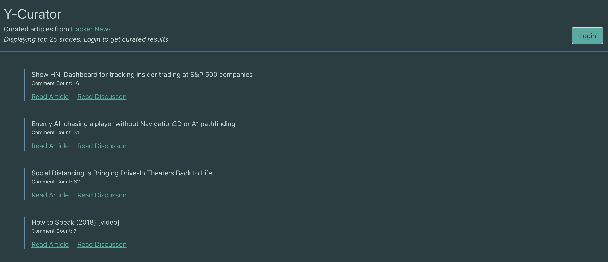
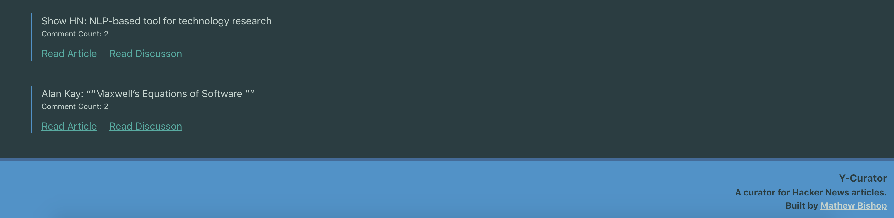
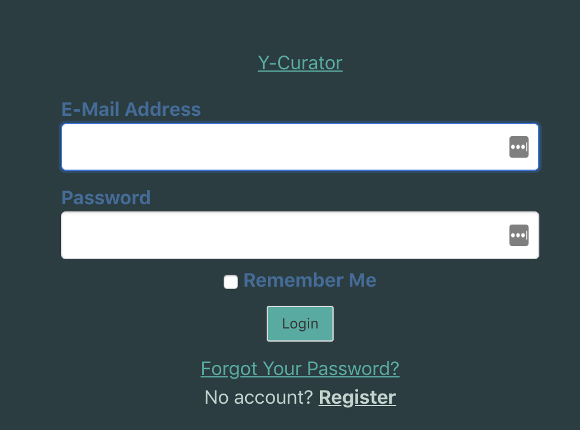
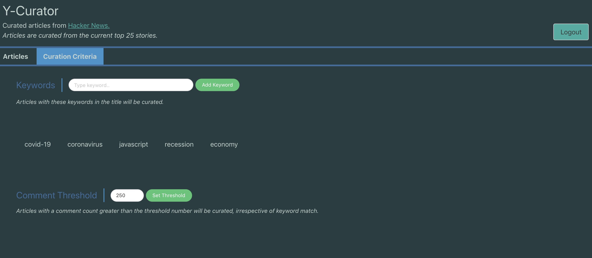

# Y-Curator

Curate or "filter" Hacker News articles you're interested in. 

## Overview

Y-Curator is a web app that pulls the top 25 stories from [Hacker News](https://news.ycombinator.com/news). If the user has an account and is logged in, the app will filter the top 25 stories to return only those that meet the criteria that the user has set. 

From the curated list of articles, users can click a link to read the article, and another link to read the discussion on Hacker News.

As of April 2020, there are 2 types of criteria the user can set:

- **Keywords** - Only articles that contain the keywords entered by the user will be returned. 
- **Comment Threshold** - All articles that have a comment count greater than the threshold set by the user will be returned, irrespective of keyword.

## Tech Stack

- PostgreSQL
- PHP (Laravel)
- jQuery

## Test Credentials

Login with test credentials to see curation features

Username: **test@test.com**

Password: **testpass**

## Notes

This app is deployed on Heroku free tier, so first load could be slow. 

## Pictures

